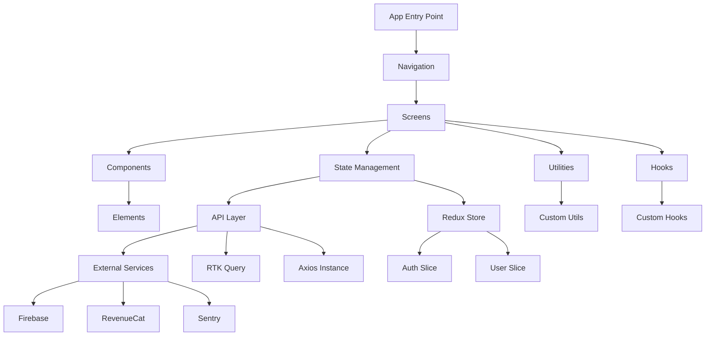
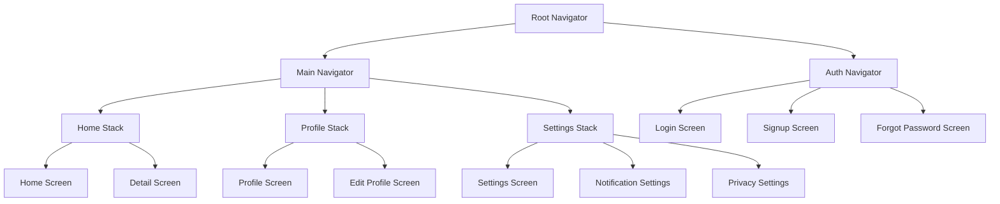
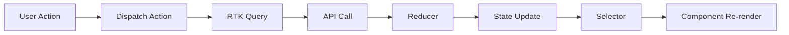
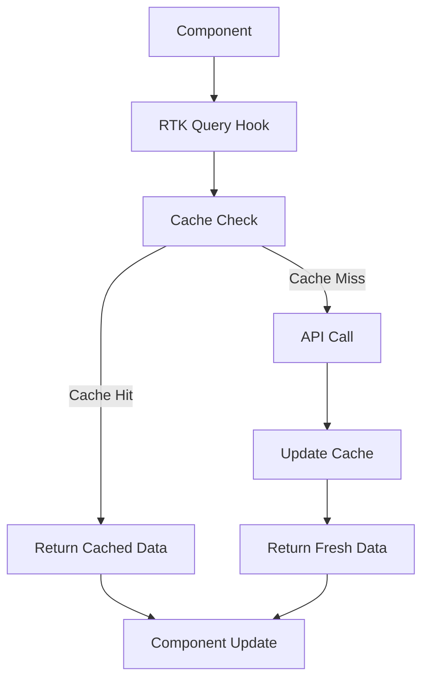
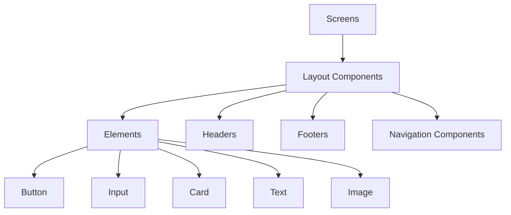
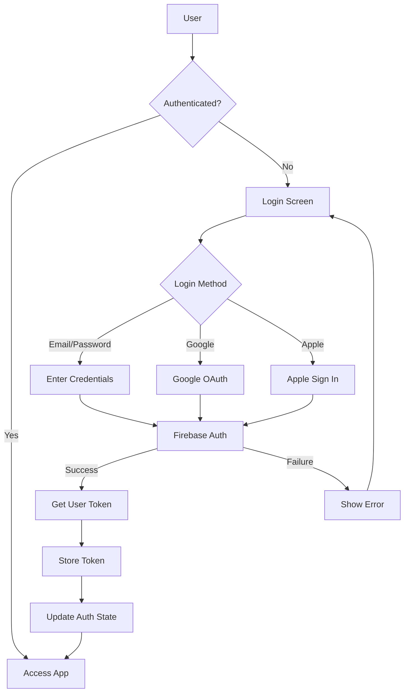
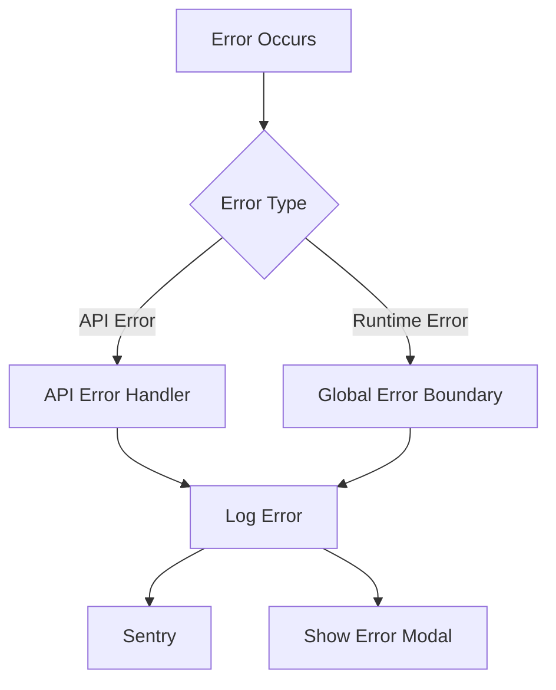
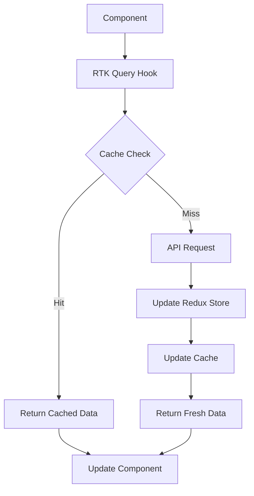

# Architecture Overview

The MVP Studio Boilerplate follows a modular, scalable, and maintainable architecture designed for different types of mobile applications. This document provides an overview of the key architectural components and design decisions.

## High-Level Architecture

The following diagram illustrates the high-level architecture of the MVP Studio Boilerplate, showcasing the main components and their interactions within the application:

## Core Components

### 1. Screens

- Represent full-page components
- Compose smaller components
- Handle screen-level logic

### 2. Components

- Reusable UI elements
- Follow atomic design principles
- Styled using Unistyles

### 3. Navigation

- Utilizes React Navigation
- Defines app's navigation structure
- Handles deep linking

### 4. State Management

- Powered by Redux Toolkit
- Centralized app state
- RTK Query for API state management

### 5. API Layer

- RTK Query for data fetching and caching
- Axios for custom API calls
- Error handling and request/response interceptors

### 6. Services

- Firebase integration
- RevenueCat for in-app purchases
- Sentry for error tracking
- Analytics services
- Push notification services
- Other third-party service integrations

### 7. Utilities

- Helper functions
- Constants
- Type definitions

### 8. Hooks

- Custom React hooks for reusable logic
- Custom hooks for common use cases

## Detailed Architecture Breakdown

### 1. App Entry Point (App.tsx)

- Sets up providers (Redux, Navigation, Theme)
- Initializes services (Firebase, Sentry)
- Renders the root navigation structure

### 2. Navigation Structure

The MVP Studio Boilerplate uses a nested navigation structure to organize different parts of the app. Here's an overview of the navigation hierarchy:

### 3. State Management Flow

The MVP Studio Boilerplate uses Redux Toolkit for state management. Here's how state changes flow through the application:

### 4. Data Flow

The data flow in the MVP Studio Boilerplate, powered by RTK Query, looks like this:

### 5. Component Hierarchy

The following diagram illustrates the hierarchical structure of components in the MVP Studio Boilerplate:

### 6. Authentication Flow

The authentication process in the MVP Studio Boilerplate follows this flow:

### 7. Error Handling Flow

Error handling in the MVP Studio Boilerplate follows this process:

### 8. API Request Lifecycle

The lifecycle of an API request in the MVP Studio Boilerplate:

## Key Architectural Decisions

### Separation of Concerns

- Clear distinction between UI components and business logic
- Use of custom hooks for reusable logic

### Centralized State Management

- Redux for global app state
- RTK Query for API state management

### API Layer Abstraction

- RTK Query for standardized API interactions
- Centralized error handling and request/response interceptors

### Modular Component Structure

- Atomic design principles for UI components
- Composition over inheritance

### Type Safety

- Extensive use of TypeScript for type checking
- Defined interfaces for API responses and app state

### Performance Optimization

- Memoization of expensive computations
- Lazy loading of screens and components

### Cross-Platform Consistency

- Platform-specific code isolated in separate files
- Use of React Native's platform-specific extensions

## Testing Strategy

- Unit Tests: For individual functions and components
- Integration Tests: For testing component interactions
- E2E Tests: Using Detox for full user flow testing

## Security Considerations

- Secure storage for sensitive data
- Secure API calls using HTTPS
- Secure authentication and authorization
- Input validation and sanitization

## Scalability and Performance

- Code splitting and lazy loading
- Optimized re-renders using React's memo and useMemo
- Efficient list rendering with FlashList

## Best Practices

- Consistent naming conventions
- Code documentation and comments
