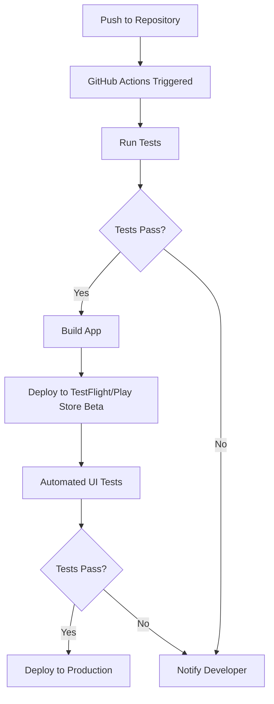

# CI/CD

Our boilerplate includes a **Continuous Integration and Continuous Deployment (CI/CD)** setup using **GitHub Actions**. This ensures that your code is automatically tested, built, and deployed whenever changes are pushed to your repository.



## GitHub Actions Workflow

The CI/CD pipeline is defined in `.github/workflows/ci-cd.yml`:

```yaml
name: CI/CD

on:
  push:
    branches: [main]
  pull_request:
    branches: [main]

jobs:
  test:
    runs-on: ubuntu-latest
    steps:
      - uses: actions/checkout@v2
      - name: Use Node.js
        uses: actions/setup-node@v2
        with:
          node-version: "14.x"
      - run: npm ci
      - run: npm run test

  lint:
    runs-on: ubuntu-latest
    steps:
      - uses: actions/checkout@v2
      - name: Use Node.js
        uses: actions/setup-node@v2
        with:
          node-version: "14.x"
      - run: npm ci
      - run: npm run lint

  build-android:
    needs: [test, lint]
    runs-on: ubuntu-latest
    steps:
      - uses: actions/checkout@v2
      - name: Set up JDK 11
        uses: actions/setup-java@v2
        with:
          java-version: "11"
          distribution: "adopt"
      - name: Build Android Release
        run: |
          cd android
          ./gradlew assembleRelease

  build-ios:
    needs: [test, lint]
    runs-on: macos-latest
    steps:
      - uses: actions/checkout@v2
      - name: Use Node.js
        uses: actions/setup-node@v2
        with:
          node-version: "14.x"
      - name: Build iOS Release
        run: |
          cd ios
          pod install
          xcodebuild -workspace MyApp.xcworkspace -scheme MyApp archive -archivePath MyApp.xcarchive -allowProvisioningUpdates

  deploy:
    needs: [build-android, build-ios]
    runs-on: ubuntu-latest
    steps:
      - name: Deploy to App Store
        run: echo "Deploy to App Store"
      - name: Deploy to Google Play
        run: echo "Deploy to Google Play"
```

This workflow does the following:

1. Runs tests and linting on every push and pull request.
2. If tests and linting pass, it builds both Android and iOS versions of the app.
3. If both builds are successful, it deploys the app to the App Store and Google Play (you would need to add the specific deployment steps).

## Environment Variables

Sensitive information like API keys should be stored as GitHub Secrets and accessed in the workflow as environment variables:

```yaml
steps:
  - name: Build Android Release
    env:
      ANDROID_KEYSTORE_PASSWORD: ${{ secrets.ANDROID_KEYSTORE_PASSWORD }}
    run: ./gradlew assembleRelease
```

## Customizing the CI/CD Pipeline

To customize the CI/CD pipeline:

1. Modify the `.github/workflows/ci-cd.yml` file.
2. Add or remove jobs as needed.
3. Adjust the triggers in the `on` section to run the workflow on different events.
