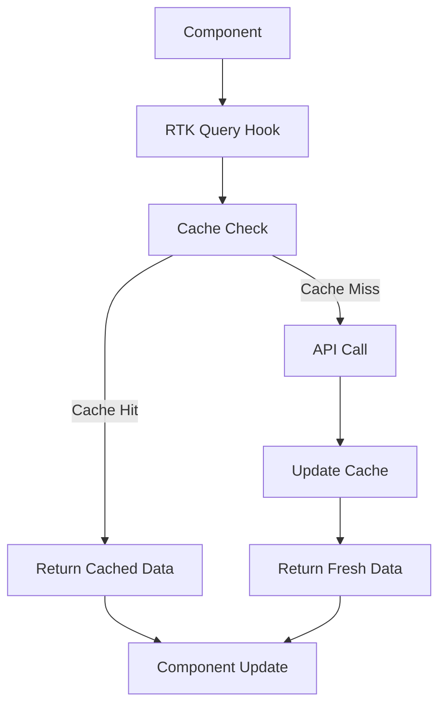

# Data Handling

Our boilerplate uses a combination of **RTK Query** for API calls and data caching, and **Redux Persist** for local data persistence. The data flow in the MVP Studio Boilerplate, powered by **RTK Query**, looks like this:



## RTK Query Setup

RTK Query is pre-configured in `src/services/api.ts`:

```typescript
import { createApi, fetchBaseQuery } from "@reduxjs/toolkit/query/react";
import { RootState } from "@/store";

export const api = createApi({
  baseQuery: fetchBaseQuery({
    baseUrl: "https://api.example.com",
    prepareHeaders: (headers, { getState }) => {
      const token = (getState() as RootState).auth.token;
      if (token) {
        headers.set("authorization", `Bearer ${token}`);
      }
      return headers;
    },
  }),
  endpoints: (builder) => ({
    // Define your endpoints here
  }),
});
```

## Defining API Endpoints

To add a new API endpoint:

```typescript
export const api = createApi({
  // ... base configuration
  endpoints: (builder) => ({
    getUsers: builder.query<User[], void>({
      query: () => "users",
    }),
    getUserById: builder.query<User, string>({
      query: (id) => `users/${id}`,
    }),
    createUser: builder.mutation<User, Partial<User>>({
      query: (newUser) => ({
        url: "users",
        method: "POST",
        body: newUser,
      }),
    }),
  }),
});

export const { useGetUsersQuery, useGetUserByIdQuery, useCreateUserMutation } =
  api;
```

## Using RTK Query in Components

```typescript
import { useGetUsersQuery, useCreateUserMutation } from "@/services/api";

function UserList() {
  const { data: users, isLoading, error } = useGetUsersQuery();
  const [createUser] = useCreateUserMutation();

  if (isLoading) return <Loading />;
  if (error) return <Error />;

  return (
    <View>
      {users.map((user) => (
        <UserItem key={user.id} user={user} />
      ))}
      <Button
        title="Add User"
        onPress={() => createUser({ name: "New User" })}
      />
    </View>
  );
}
```

## Data Persistence

Redux Persist is used for local data persistence. It's configured in `src/store/index.ts`:

```typescript
import { persistStore, persistReducer } from "redux-persist";
import AsyncStorage from "@react-native-async-storage/async-storage";

const persistConfig = {
  key: "root",
  storage: AsyncStorage,
  whitelist: ["auth", "user"], // Only persist these reducers
};

const persistedReducer = persistReducer(persistConfig, rootReducer);
```

## Offline Support

For offline support, we use a combination of Redux Persist and custom middleware:

1. Store API responses in Redux state.
2. Use Redux Persist to save this state to AsyncStorage.
3. Implement custom middleware to queue actions when offline:

```typescript
const offlineMiddleware =
  ({ dispatch, getState }) =>
  (next) =>
  (action) => {
    if (!navigator.onLine) {
      return dispatch(addToOfflineQueue(action));
    }
    return next(action);
  };
```

4. Process the queue when coming back online.

## Data Transformation

For complex data transformations, we use the `reselect` library:

```typescript
import { createSelector } from "reselect";

const selectUsers = (state) => state.users;
const selectProjects = (state) => state.projects;

export const selectUserProjects = createSelector(
  [selectUsers, selectProjects],
  (users, projects) => {
    // Perform complex data transformation here
  }
);
```

## Best Practices

1. Use RTK Query for all API calls to benefit from automatic caching and refetching.
2. Implement proper error handling and loading states in your components.
3. Use selectors for derived state to improve performance.
4. Be mindful of what data you persist locally and ensure sensitive data is properly secured.
5. Implement proper data validation both on the client and server side.
