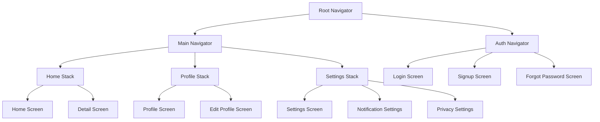

# Navigation

Our boilerplate uses React Navigation to handle navigation flows. The navigation structure is pre-configured to support common app layouts and can be easily customized.

## Navigation Structure

The navigation in our boilerplate is structured as follows:



## Usage

Here's how you can use the pre-configured navigation in the app:

```typescript
import { NavigationContainer } from "@react-navigation/native";
import RootNavigator from "@/navigation/RootNavigator";
import { linking } from "@/navigation/linking";

function App() {
  return (
    <NavigationContainer linking={linking}>
      <RootNavigator />
    </NavigationContainer>
  );
}
```

## Deep Linking

Deep linking is pre-configured in the boilerplate. The configuration is in `src/navigation/linking.ts`:

```typescript
export const linking = {
  prefixes: ["myapp://", "https://myapp.com"],
  config: {
    screens: {
      Home: "home",
      Profile: "user/:id",
      NotFound: "*",
    },
  },
};
```

To handle deep links:

1. Update the `linking` configuration in `src/navigation/linking.ts`.
2. Handle the deep link in the appropriate screen component using `useRoute` hook.

```typescript
import { useRoute } from "@react-navigation/native";

function ProfileScreen() {
  const route = useRoute();
  const { id } = route.params;

  // Use the id to fetch user data
}
```

## Routing

Routing is handled automatically by React Navigation based on the navigator structure. To navigate between screens:

```typescript
import { useNavigation } from "@react-navigation/native";

function MyComponent() {
  const navigation = useNavigation();

  const handlePress = () => {
    navigation.navigate("Profile", { id: "123" });
  };

  return <Button title="Go to Profile" onPress={handlePress} />;
}
```

## Navigation Guards

Navigation guards are implemented using custom navigators that wrap the built-in React Navigation navigators. Here's an example of an authenticated navigator:

```typescript
import React from "react";
import { createStackNavigator } from "@react-navigation/stack";
import { useSelector } from "react-redux";
import { RootState } from "@/store";
import LoginScreen from "@/screens/LoginScreen";
import MainNavigator from "./MainNavigator";

const Stack = createStackNavigator();

export function AuthenticatedNavigator() {
  const isAuthenticated = useSelector(
    (state: RootState) => state.auth.isAuthenticated
  );

  return (
    <Stack.Navigator>
      {isAuthenticated ? (
        <Stack.Screen name="Main" component={MainNavigator} />
      ) : (
        <Stack.Screen name="Login" component={LoginScreen} />
      )}
    </Stack.Navigator>
  );
}
```

This navigator checks the authentication state and renders either the main app screens or the login screen accordingly.

## Custom Navigation Hooks

We've included several custom navigation hooks to make common navigation tasks easier:

```typescript
import { useAppNavigation } from "@/hooks/useAppNavigation";

function MyComponent() {
  const { navigateToHome, navigateToProfile, openModal } = useAppNavigation();

  return (
    <>
      <Button title="Go to Home" onPress={() => navigateToHome()} />
      <Button title="Go to Profile" onPress={() => navigateToProfile()} />
      <Button title="Open Modal" onPress={() => openModal("ModalName")} />
    </>
  );
}
```
