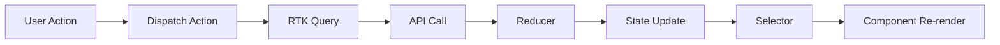

# State Management

Our boilerplate uses **Redux Toolkit** for efficient state management, combined with **RTK Query** for API calls and caching, and **Redux Persist** for state persistence. This setup provides a powerful and flexible way to manage your app's state and handle data fetching.

Here's how state changes flow through the application:



## Redux Toolkit Setup

Redux Toolkit is configured in `src/store/index.ts`:

```typescript
import { configureStore } from "@reduxjs/toolkit";
import { persistStore, persistReducer } from "redux-persist";
import AsyncStorage from "@react-native-async-storage/async-storage";
import { api } from "@/services/api";
import rootReducer from "./rootReducer";

const persistConfig = {
  key: "root",
  storage: AsyncStorage,
  whitelist: ["auth", "user"],
};

const persistedReducer = persistReducer(persistConfig, rootReducer);

export const store = configureStore({
  reducer: persistedReducer,
  middleware: (getDefaultMiddleware) =>
    getDefaultMiddleware({
      serializableCheck: {
        ignoredActions: [FLUSH, REHYDRATE, PAUSE, PERSIST, PURGE, REGISTER],
      },
    }).concat(api.middleware),
});

export const persistor = persistStore(store);
```

## Redux Toolkit Slices

We use Redux Toolkit's `createSlice` to define our reducers and actions:

```typescript
import { createSlice, PayloadAction } from "@reduxjs/toolkit";

interface AuthState {
  token: string | null;
  isAuthenticated: boolean;
}

const initialState: AuthState = {
  token: null,
  isAuthenticated: false,
};

const authSlice = createSlice({
  name: "auth",
  initialState,
  reducers: {
    setToken: (state, action: PayloadAction<string>) => {
      state.token = action.payload;
      state.isAuthenticated = true;
    },
    clearToken: (state) => {
      state.token = null;
      state.isAuthenticated = false;
    },
  },
});

export const { setToken, clearToken } = authSlice.actions;
export default authSlice.reducer;
```

## RTK Query Setup

RTK Query is configured in `src/services/api.ts`:

```typescript
import { createApi, fetchBaseQuery } from "@reduxjs/toolkit/query/react";
import { RootState } from "@/store";

export const api = createApi({
  baseQuery: fetchBaseQuery({
    baseUrl: "https://api.example.com",
    prepareHeaders: (headers, { getState }) => {
      const token = (getState() as RootState).auth.token;
      if (token) {
        headers.set("authorization", `Bearer ${token}`);
      }
      return headers;
    },
  }),
  endpoints: (builder) => ({
    getUsers: builder.query<User[], void>({
      query: () => "users",
    }),
    getUserById: builder.query<User, string>({
      query: (id) => `users/${id}`,
    }),
    createUser: builder.mutation<User, Partial<User>>({
      query: (newUser) => ({
        url: "users",
        method: "POST",
        body: newUser,
      }),
    }),
  }),
});

export const { useGetUsersQuery, useGetUserByIdQuery, useCreateUserMutation } =
  api;
```

## Using Redux and RTK Query in Components

We've included custom hooks for easy access to the Redux store and RTK Query:

```typescript
import { useAppSelector, useAppDispatch } from "@/hooks/useRedux";
import { setToken } from "@/store/slices/authSlice";
import { useGetUsersQuery, useCreateUserMutation } from "@/services/api";

function UserComponent() {
  const dispatch = useAppDispatch();
  const isAuthenticated = useAppSelector((state) => state.auth.isAuthenticated);
  const { data: users, isLoading, error } = useGetUsersQuery();
  const [createUser] = useCreateUserMutation();

  const handleLogin = async () => {
    const token = "example_token";
    dispatch(setToken(token));
  };

  const handleCreateUser = async () => {
    try {
      await createUser({ name: "New User" });
    } catch (error) {
      console.error("Failed to create user:", error);
    }
  };

  if (!isAuthenticated) {
    return <LoginButton onPress={handleLogin} />;
  }

  if (isLoading) return <Loading />;
  if (error) return <Error />;

  return (
    <View>
      {users.map((user) => (
        <UserItem key={user.id} user={user} />
      ))}
      <Button title="Add User" onPress={handleCreateUser} />
    </View>
  );
}
```

## Best Practices

1. Use Redux Toolkit's `createSlice` for all your reducers to minimize boilerplate.
2. Use RTK Query for all API calls to benefit from automatic caching and refetching.
3. Use the `useAppSelector` and `useAppDispatch` hooks for type-safe Redux usage.
4. Implement proper error handling and loading states in your components when using RTK Query.
5. Use Redux Persist carefully, only persisting necessary state to avoid performance issues.
