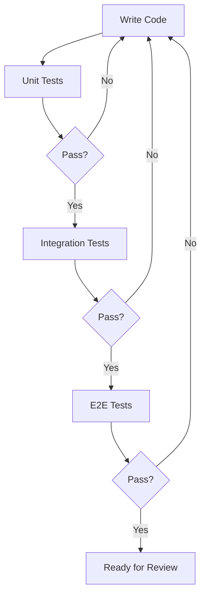

# Testing

Our boilerplate comes with a testing setup to ensure code quality and reliability. We use Jest as our test runner, React Native Testing Library for component testing, and Detox for end-to-end testing.



## Unit Testing with Jest

Jest is configured to run unit tests for your JavaScript/TypeScript code.

### Running Tests

To run all tests:

```bash
npm run test
```

To run tests in watch mode:

```bash
npm run test:watch
```

### Writing Unit Tests

Here's an example of a unit test for a utility function:

```typescript
export const add = (a: number, b: number) => a + b;

describe("Math utils", () => {
  it("should add two numbers correctly", () => {
    expect(add(1, 2)).toBe(3);
    expect(add(-1, 1)).toBe(0);
    expect(add(0, 0)).toBe(0);
  });
});
```

## Component Testing with React Native Testing Library

We use React Native Testing Library to test React components in a way that resembles how users interact with your app.

### Writing Component Tests

Here's an example of a component test:

```typescript
import React from "react";
import { render, fireEvent } from "@testing-library/react-native";
import { Button } from "../Button";

describe("Button", () => {
  it("renders correctly", () => {
    const { getByText } = render(
      <Button title="Press me" onPress={() => {}} />
    );
    expect(getByText("Press me")).toBeTruthy();
  });

  it("calls onPress when pressed", () => {
    const onPress = jest.fn();
    const { getByText } = render(<Button title="Press me" onPress={onPress} />);
    fireEvent.press(getByText("Press me"));
    expect(onPress).toHaveBeenCalledTimes(1);
  });
});
```

## End-to-End Testing with Detox

Detox is used for writing and running end-to-end tests on actual devices or simulators.

### Setting Up Detox

Detox is pre-configured in the boilerplate. To run Detox tests:

1. Build the app for testing:

   ```bash
   detox build --configuration ios.sim.debug
   ```

2. Run the tests:
   ```bash
   detox test --configuration ios.sim.debug
   ```

### Writing E2E Tests

Here's an example of a Detox test:

```typescript
describe("Example", () => {
  beforeEach(async () => {
    await device.reloadReactNative();
  });

  it("should have welcome screen", async () => {
    await expect(element(by.text("Welcome"))).toBeVisible();
  });

  it("should show hello screen after tap", async () => {
    await element(by.text("Hello")).tap();
    await expect(element(by.text("Hello!!!"))).toBeVisible();
  });
});
```
